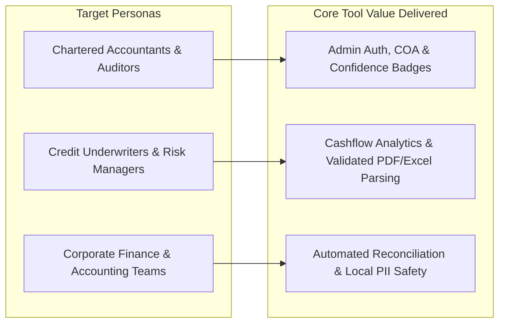
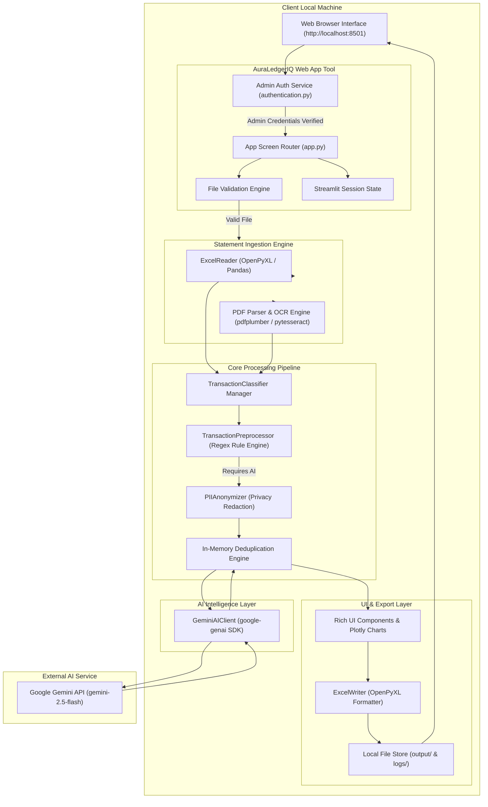
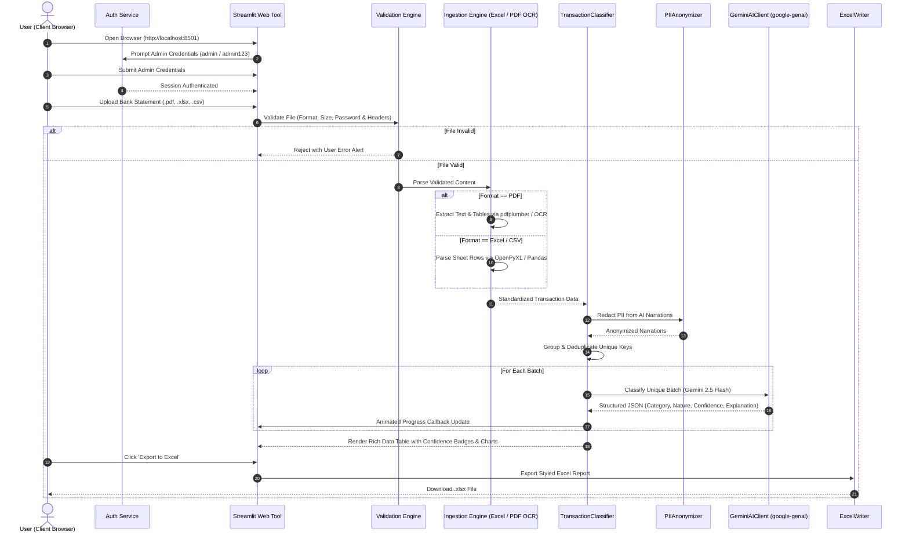
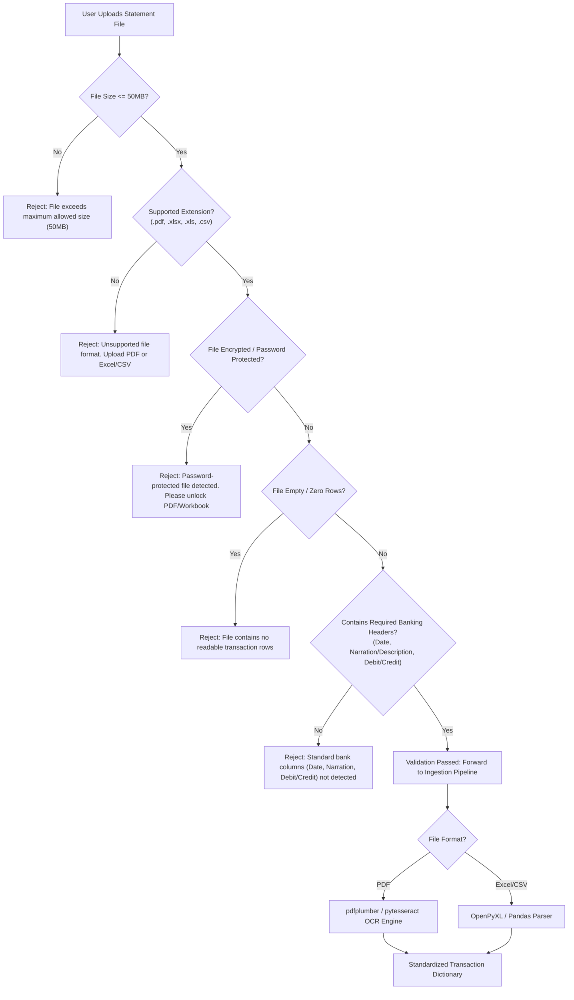
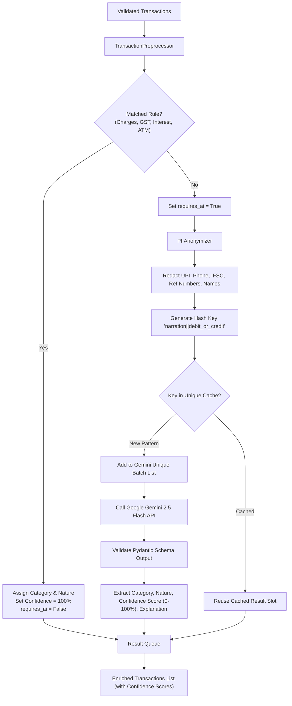
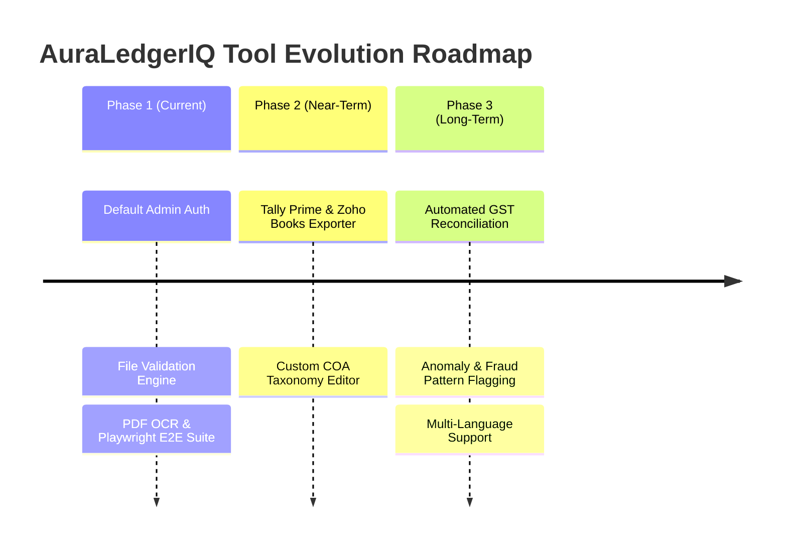

# Project Requirement Document (PRD)
## AuraLedgerIQ — AI-Powered Bank Statement Intelligence & Audit Tool

---

## 1. Document Overview & Metadata

| Attribute | Details |
| :--- | :--- |
| **Product Name** | AuraLedgerIQ |
| **Document Version** | 2.4.0 |
| **Status** | Approved / Playwright E2E Baseline |
| **Target Audience** | Engineering Team, Product Managers, Financial Auditors, Chartered Accountants, Credit Underwriters |
| **Core Repository** | `auraledger` |
| **Primary Stack** | Python 3.10+, Streamlit (Web App UI), Google GenAI SDK (Gemini 2.5 Flash), pdfplumber, pytesseract (PDF OCR), Playwright, OpenPyXL, Pandas, Plotly |

---

## 2. Executive Summary & Mission Statement

### 2.1 Problem Statement
Financial auditors, chartered accountants, credit underwriters, and corporate finance teams manually process thousands of bank statements every month. Indian banking transaction narrations (NEFT, RTGS, IMPS, UPI, POS, Charges, GST) are notoriously cryptic, containing unstructured text, merchant codes, reference numbers, and Personally Identifiable Information (PII). Manual categorization is slow, error-prone, non-standardized, and exposes sensitive PII to external third-party workers.

### 2.2 Product Mission
**AuraLedgerIQ** is a lightweight, privacy-first, AI-powered financial intelligence **Tool** designed to be installed on a client's local machine and accessed directly via their web browser. It features default Admin user authentication, rigorous file validation, dual statement ingestion (PDF OCR & Excel), local PII redaction, AI categorization via **Google Gemini 2.5 Flash**, confidence scoring, Playwright E2E automated test coverage, and a rich, professional UI with auditor-ready Excel reports.

### 2.3 Core Value Proposition
1. **User Authentication & Default Admin Account**: Built-in default Admin user authentication (`admin` / `admin123`) securing client financial data out-of-the-box, with password customization in Settings.
2. **Comprehensive File Validation Logic**: Pre-parse verification of file extension, MIME type, file size, password encryption, and structural column headers before processing.
3. **Dual PDF (with OCR) & Excel Statement Ingestion**: Ingests both digital/scanned PDF bank statements (using PDF OCR and tabular text extraction) and multi-sheet Excel/CSV files.
4. **Privacy-First PII Masking**: Redacts UPI IDs, account numbers, phone numbers, IFSC codes, UTR reference numbers, and customer names before API transmission.
5. **Google Gemini Intelligence Engine**: Uses Google Gemini 2.5 Flash via the official `google-genai` SDK with strict Pydantic schema enforcement.
6. **Confidence Scoring & Visual Badging**: Explicit confidence scores (0% to 100%) with color-coded UI badges (Green ≥80%, Amber 50–79%, Red <50%).
7. **Automated Playwright E2E Browser Testing**: Fully automated Chromium browser test suite verifying login, statement uploads, and Excel report downloads.
8. **Professional, Neat & Rich UI Design**: Modern interface featuring glassmorphism containers, Google Fonts (Inter/Outfit), dark/light theme styling, animated batch progress bars, interactive Plotly charts, and one-click Excel report export (`.xlsx`).

---

## 3. Product Scope & Target Personas

### 3.1 Target Personas & Stakeholder Mapping



- **Chartered Accountants (CAs) & Financial Auditors**: Require an authenticated tool, strict file validation, automated categorization into standard Chart of Accounts (COA) with confidence scores, and downloadable Excel reports.
- **Credit Underwriters & Risk Managers**: Need to evaluate cashflows, recurring income, EMI debits, and high-value transfers from validated PDF/Excel client statements.
- **Corporate Finance Teams**: Require rapid month-end bank reconciliation while keeping client statement PII safe through local redaction.

---

## 4. System Architecture & Data Flow

### 4.1 System Architecture Diagram



### 4.2 End-to-End Processing Workflow



---

## 5. Functional Requirements & Detailed Flow Diagrams

### 5.1 Admin Authentication Management

#### Session State Diagram
```mermaid
stateDiagram-v2
    [*] --> LoginScreen: User Opens Web App
    
    state LoginScreen {
        [*] --> EnterCredentials: Enter Admin Username & Password
        EnterCredentials --> SubmitAuth: Click 'Login'
        SubmitAuth --> CheckAuth: Verify in authentication.py
        CheckAuth --> InvalidAlert: Incorrect Username / Password
        InvalidAlert --> EnterCredentials
    }
    
    CheckAuth --> AuthenticatedState: Admin Credentials Valid
    
    state AuthenticatedState {
        [*] --> AppDashboard: Active Session (st.session_state.authenticated = True)
        AppDashboard --> StatementUpload: Navigate to Upload
        StatementUpload --> ViewResults: View Analysis & Confidence Badges
        ViewResults --> AppSettings: Manage Gemini API Key / Change Password
        
        AuthenticatedState --> LogoutAction: Click 'Logout'
    }
    
    LogoutAction --> LoginScreen: Clear Session State & Redirect
```

#### Default Admin User Credentials & Management
- **Default Admin Account Provisioning**:
  - **Default Username**: `admin`
  - **Default Passcode / Password**: `admin123`
  - **Default Role**: Administrator (`role = "admin"`)
- **First-Time Initial Setup**: Automatically seeds the default Admin user credentials upon initial app initialization if no user configuration exists.
- **Credential Updates**: Administrators can update their username and password anytime via the **Settings Screen**, saved locally in `config/config.json`.
- **Session State Management**: Securely persists authentication flags (`authenticated`, `username`, `role`) within `st.session_state`.
- **Session Logout**: Provides a prominent logout button in the sidebar to terminate active admin sessions instantly.

---

### 5.2 Statement Ingestion & Comprehensive File Validation Logic

#### File Validation & Ingestion Pipeline Diagram


- **File Integrity & Format Check**: Validates extension (`.pdf`, `.xlsx`, `.xls`, `.csv`) and verifies MIME type.
- **File Size Validation**: Enforces maximum file size limits (50 MB) with helpful warning dialogs.
- **Password & Encryption Detection**: Detects password-protected PDFs or encrypted Excel workbooks and prompts the user to provide an unencrypted statement.
- **Header & Schema Discovery**: Inspects first 20 rows to detect required banking headers (`Date`, `Narration`/`Description`, `Debit`/`Credit` or `Amount`), providing guidance if non-standard headers are used.
- **Empty Row Scrubbing**: Automatically ignores bank logos, disclaimers, and blank padding rows.

---

### 5.3 Deterministic Rule Engine (Preprocessor)
- **Zero-Latency Regex Matching**: Automatically categorizes standard Indian bank fee entries, interest credits, and ATM withdrawals without calling the AI model.
- **Confidence Score**: Assigns `100%` confidence (`1.0`) to all rule-matched transactions.

---

### 5.4 High-Precision PII Anonymization Engine
The [PIIAnonymizer](file:///c:/Users/user/Finnovate/dev/auralytic/workspace/auraledger/src/pii_anonymizer.py) redacts privacy-sensitive information prior to payload delivery to the Google Gemini API:

| PII Category | Pattern Matched | Replacement Token |
| :--- | :--- | :--- |
| **UPI ID** | `user@bank` (e.g. `john.doe@okicici`) | `[UPI]` |
| **IFSC Code** | 4 letters + 0 + 6 alphanumeric (e.g. `SBIN0001234`) | `[IFSC]` |
| **Mobile Number** | 10-digit Indian numbers (+91/0 prefix) | `[PHONE]` |
| **Reference / UTR** | 12-digit numbers, IMPS/NEFT/RTGS UTRs | `[REF]` |
| **Account / Card** | 9 to 18 digits or masked `XXXX` patterns | `[NUM]` |
| **Customer Name** | Contextual regex after `PAY TO`, `BY`, `TRANSFER FROM` | `[NAME]` |

---

### 5.5 Classification, Deduplication & Confidence Scoring Pipeline

#### Classification & Confidence Scoring Flowchart


- **Explicit Confidence Scoring**:
  - **Rule Match**: `Confidence = 100%` (1.0).
  - **Gemini Model Output**: Evaluates transaction context and returns confidence rating (`0.0` to `1.0`).
- **Color-Coded Visual Badging**:
  - 🟢 **High Confidence (≥ 80%)**: Verified automatically.
  - 🟡 **Moderate Confidence (50% – 79%)**: Acceptable with optional review.
  - 🔴 **Low Confidence (< 50%)**: Highlighted with a warning badge for manual auditor review.

---

### 5.6 Google Gemini AI Client Integration
- **Exclusive AI Provider**: **Google Gemini 2.5 Flash** using `google-genai` Python SDK.
- **Pydantic Schema Enforcement**: Guarantees output contains `category`, `nature`, `confidence` (float), and `explanation` string.

---

### 5.7 Premium Professional UI & Interactive Visualization System

#### UI Design System & Component Architecture
- **Design Aesthetics & Typography**:
  - Built with custom CSS injection using Google Fonts (`Inter` and `Outfit`).
  - Professional Slate & Deep Indigo palette (`#0F172A`, `#1E293B`, `#6366F1`, `#10B981`, `#EF4444`).
- **Hero Metrics & Glassmorphism Cards**:
  - Metric cards for Total Inflow, Total Outflow, Net Cashflow, Categorization Rate, and Average Confidence Score with rounded borders, soft drop shadows, and subtle glassmorphism backdrop blurs.
- **Animated Progress Indicators**:
  - Smooth animated progress bar during Gemini batch processing showing real-time batch counts and throughput status.
- **Interactive Data Table & Filtering**:
  - Searchable data grid displaying Confidence Score Badges, Category tags, Nature, and Auditor explanations.
  - Filter transactions by category or low confidence (`< 70%`).
  - Inline category manual edit overrides with immediate state updates.
- **Interactive Analytics Charts**:
  - Powered by Plotly: Category breakdown pie charts, monthly inflow/outflow bar charts, and confidence distribution histograms.
- **Auditor Excel Exporter**:
  - Download formatted `.xlsx` reports with custom header styling, column widths, summary tabs, and confidence scores.

---

## 6. Non-Functional Requirements (NFRs)

### 6.1 Performance & Throughput
- **Fast Batch Ingestion**: Deduplication and Gemini batch processing process 1,000 transactions in under 15 seconds.
- **Payload Optimization**: Batches 25–50 unique transactions per Gemini API call.

### 6.2 Data Security & Privacy Compliance
- **Zero Raw PII Exposure**: UPI handles, account numbers, and phone numbers scrubbed locally before API calls.
- **Client Machine Residency**: Input files, OCR outputs, logs, and Excel reports remain on the client's local system.

### 6.3 Usability & Design Excellence
- Modern visual hierarchy, responsive layout, clear error alerts, custom CSS badges, and zero generic unstyled browser defaults.

---

## 7. Directory & File Structure Reference

```
auraledger/
├── app.py                      # Main Streamlit router & local Web UI entrypoint
├── requirements.txt            # Python dependencies (Streamlit, google-genai, pdfplumber, pytesseract, openpyxl, plotly, playwright)
├── PRD.md                      # Product Requirement Document (This File)
├── config/
│   ├── config_manager.py       # Local user config, Admin credentials & Gemini API key manager
│   └── settings.py             # Global settings & default parameters
├── components/
│   └── sidebar.py              # Navigation sidebar & Admin user session widget
├── screens/
│   ├── Login.py                # Admin user authentication screen
│   ├── Dashboard.py            # Financial overview metrics, Plotly charts & confidence breakdown
│   ├── Upload.py               # PDF/Excel uploader, validation engine & OCR trigger
│   ├── Results.py              # Interactive table with confidence badges & Excel exporter
│   └── Settings.py             # Gemini API key & Admin password management screen
├── services/
│   ├── authentication.py       # Admin login & credential verification service
│   ├── validation.py           # File validation engine (format, size, password, headers)
│   ├── classification_service.py # Core orchestrator service
│   └── storage.py              # Local file persistence helper
├── tests/
│   ├── unit/                   # Unit test suite (Validators, PII, Auth)
│   ├── integration/            # Integration test suite (PostgreSQL, Gemini schema)
│   └── e2e/                    # Playwright E2E browser automation test suite
└── src/
    ├── main.py                 # Core CLI runner
    ├── ai_client.py            # GeminiAIClient implementation (google-genai SDK)
    ├── pdf_reader.py           # PDF Bank Statement Parser & OCR Engine
    ├── pii_anonymizer.py       # PII regex redaction engine
    ├── preprocessor.py         # Rule-based transaction preprocessor
    ├── transaction_builder.py  # Standardized transaction object constructor
    ├── transaction_classifier.py # Main classification & deduplication logic
    ├── excel_reader.py         # Excel/CSV bank statement parser
    ├── excel_writer.py         # Openpyxl Excel exporter with confidence scores
    └── utils.py                # Utility helpers & prompt loaders
```

---

## 8. Verification & Test Plan

### 8.1 Automated Unit & Integration Tests
- **Admin Auth Test**: Validate default Admin credentials (`admin` / `admin123`) authentication, password update, and session clearance.
- **Validation Engine Test**: Test rejection of oversized files (>50MB), unsupported formats, password-encrypted PDFs, and empty files.
- **PDF OCR & Ingestion Test**: Validate table and text extraction from digital and scanned bank PDFs.
- **PII Anonymizer Test**: Verify regex scrubbing for UPI handles, mobile numbers, IFSC codes, and reference numbers.
- **Gemini Client Integration Test**: Validate structured schema parsing, confidence scores, and fallback handling.

### 8.2 Playwright Automated End-to-End (E2E) Browser Test Suite
- **Admin Authentication E2E**: Playwright Chromium test launching `http://localhost:8501`, automated submission of `admin` / `admin123` credentials, and verification of Dashboard session loading.
- **Statement Drag-and-Drop Upload E2E**: Automated upload of sample `.pdf` and `.xlsx` statement files, testing error callouts for invalid/encrypted files and progress bar updates.
- **Results Grid & Download E2E**: DOM assertions for confidence score badges (Green/Amber/Red) and intercepting `Export to Excel` browser file download events.

### 8.3 Manual Acceptance Tests
1. **Default Admin Login Flow**: Log in using default credentials `admin` / `admin123`; verify successful redirect to dashboard.
2. **Password Settings Test**: Test updating admin password via the Settings screen.
3. **File Validation Test**: Attempt uploading password-protected PDFs and files missing standard headers; verify alert messages.
4. **Rich UI Inspection**: Verify font rendering, metric hero cards, Plotly charts, and color-coded confidence badges.
5. **Excel Export Test**: Verify exported Excel file formatting and confidence score columns.

---

## 9. Future Product Roadmap



1. **Accounting Software Exporter**: Direct XML/JSON export formats for Tally Prime, QuickBooks, and Zoho Books.
2. **Custom COA Taxonomy Engine**: Allow CAs to customize Chart of Accounts categories per client.
3. **Automated GST & Fraud Anomaly Detection**: Flag circular transactions, split debits under tax limits, and GST mismatch patterns.

---

*End of Project Requirement Document.*
