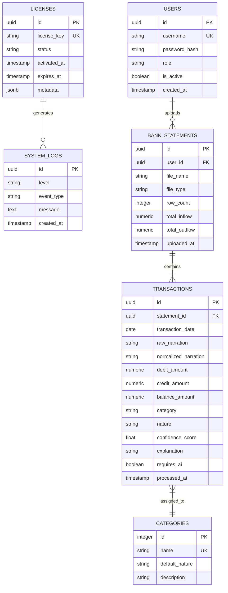
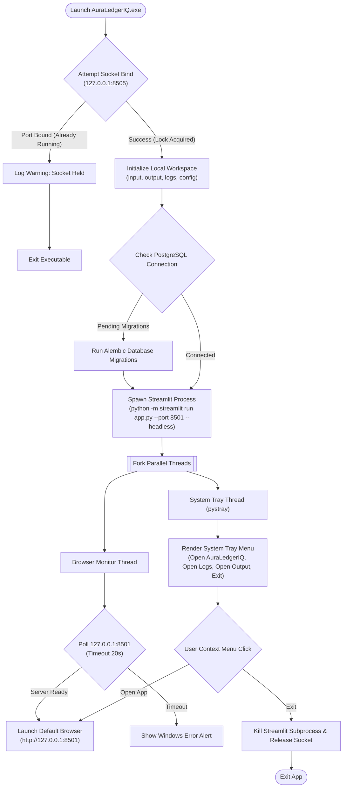
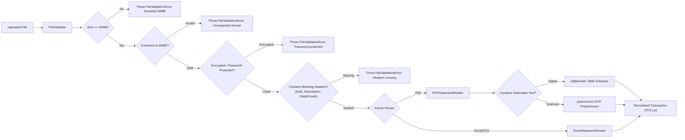
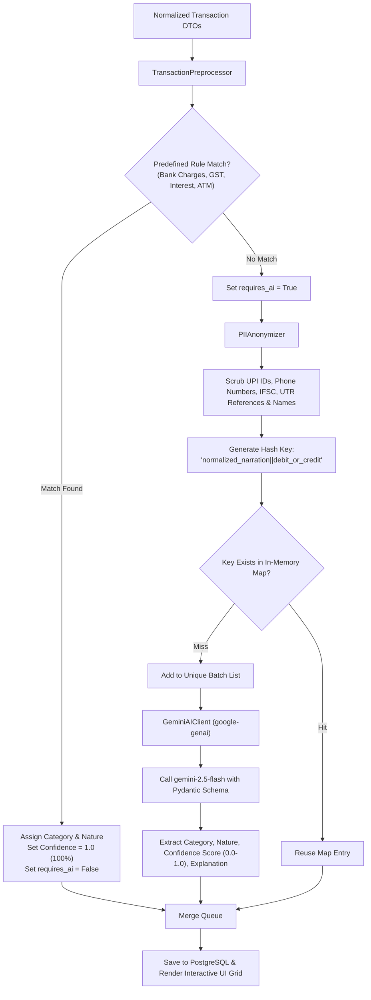

# Technical Specification (TECH-SPEC)
## AuraLedgerIQ — AI-Powered Bank Statement Intelligence & Audit Tool

**Document Version:** 2.1.0  
**Status:** Approved Technical Blueprint  
**Primary Stack:** Python 3.10+, Streamlit, PostgreSQL, SQLAlchemy, Google GenAI SDK (Gemini 2.5 Flash), pdfplumber, pytesseract (PDF OCR), Playwright (E2E Browser Automation), PyInstaller (.exe launcher)

---

## 1. Executive Purpose & Architecture Overview

This document specifies the technical architecture, software engineering standards, database schema, Object-Oriented (OOP) design patterns, SOLID principles, executable packaging pipeline, exception handling strategies, and **Playwright End-to-End (E2E)** browser testing workflows for **AuraLedgerIQ**.

AuraLedgerIQ operates as a privacy-first, desktop-packaged Web Application Tool. It runs a local Python backend server, connects to a **PostgreSQL** database for persistent storage, executes a headless **Streamlit** Web UI server, and launches seamlessly inside the user's web browser (`http://localhost:8501`) via a compiled Windows executable (`.exe`).

---

## 2. Technology Stack & Environment

| Component Layer | Technology Selected | Rationale & Specifications |
| :--- | :--- | :--- |
| **Primary Language** | Python 3.10+ | Strong ecosystem for data processing, PDF manipulation, OCR, and AI SDKs. |
| **Web UI Framework** | Streamlit | Rapid, component-driven Web App UI styled with custom CSS and Plotly charts. |
| **Database Engine** | PostgreSQL 14+ | ACID-compliant relational database for persisting statements, transactions, audit trails, and user configs. |
| **ORM & Migrations** | SQLAlchemy 2.0 & Alembic | Clean database abstractions, session pooling, and version-controlled schema migrations. |
| **AI Intelligence Model** | Google Gemini 2.5 Flash (`google-genai` SDK) | Low-latency, structured JSON output generation bound by Pydantic schemas. |
| **PDF Ingestion & OCR** | `pdfplumber` & `pytesseract` / `pdf2image` | Dual-mode parsing: vector table extraction for digital PDFs, Tesseract OCR for scanned image PDFs. |
| **Excel / CSV Ingestion** | OpenPyXL & Pandas | Sheet ingestion, header row identification, data sanitization, and openpyxl report formatting. |
| **E2E Testing Engine** | Playwright (`pytest-playwright`) | Fast, reliable headless Chromium browser automation for testing UI flows, login, uploads, and downloads. |
| **Desktop Executable Launcher** | PyInstaller & `pystray` | Bundles Python runtime into `AuraLedgerIQ.exe` with socket port locking, server polling, and system tray integration. |

---

## 3. Architecture Blueprint & Software Engineering Principles

### 3.1 Clean Layered Architecture

```text
┌─────────────────────────────────────────────────────────┐
│                    Web Browser UI                       │
│             (Streamlit Screens & Custom CSS)            │
└────────────────────────────┬────────────────────────────┘
                             │
                             ▼
┌─────────────────────────────────────────────────────────┐
│                 Presentation & Routing                  │
│       (app.py, Navigation Router, Session State)        │
└────────────────────────────┬────────────────────────────┘
                             │
                             ▼
┌─────────────────────────────────────────────────────────┐
│                 Application Use Cases                   │
│ (Services: Auth, License, Validation, Classification)   │
└────────────────────────────┬────────────────────────────┘
                             │
                             ▼
┌─────────────────────────────────────────────────────────┐
│                    Domain Model                         │
│  (Entities: Transaction, License, Category, Confidence) │
└────────────────────────────┬────────────────────────────┘
                             │
                             ▼
┌─────────────────────────────────────────────────────────┐
│                 Infrastructure Layer                    │
│ (PostgreSQL/SQLAlchemy, Gemini AI Client, PDF/Excel)    │
└────────────────────────────┬────────────────────────────┘
```

---

### 3.2 SOLID Principles Enforcement

1. **Single Responsibility Principle (SRP)**:
   - `FileValidator`: Strictly responsible for pre-parse file integrity, size, and header checks.
   - `PIIAnonymizer`: Strictly responsible for regex-based PII scrubbing.
   - `GeminiAIClient`: Strictly responsible for formatting API requests and parsing Pydantic LLM outputs.
   - `ExcelWriter`: Strictly responsible for formatting and generating `.xlsx` workbooks.

2. **Open/Closed Principle (OCP)**:
   - File parsers implement a base interface (`BaseStatementReader`). Adding a new format (e.g., XML/JSON) extends `BaseStatementReader` without modifying existing ingestion logic.
   - Preprocessor rules implement extensible pattern matchers (`BaseRule`).

3. **Liskov Substitution Principle (LSP)**:
   - All parser implementations (`PDFStatementReader`, `ExcelStatementReader`) conform to `BaseStatementReader` and can be substituted transparently in the ingestion pipeline.

4. **Interface Segregation Principle (ISP)**:
   - Dedicated service protocols (`ILicenseService`, `IAuthService`, `IClassificationService`) ensure components depend only on the specific methods they consume.

5. **Dependency Inversion Principle (DIP)**:
   - High-level classification services depend on domain abstractions (`BaseAIClient`), not concrete LLM SDK implementations. Dependency Injection is handled via factory functions (`get_ai_client()`).

---

### 3.3 Object-Oriented Design (OOP) Patterns Applied

- **Factory Pattern**: `AIClientFactory` instantiates the appropriate AI client based on application configuration.
- **Strategy Pattern**: Ingestion strategy dynamically switches between `VectorPDFStrategy`, `OcrPDFStrategy`, and `ExcelSheetStrategy` depending on input file analysis.
- **Repository Pattern**: `TransactionRepository` encapsulates PostgreSQL database access logic, isolating SQL queries from business services.
- **Singleton Pattern**: `ConfigManager` and socket port lock instances maintain single-instance state during desktop execution.

---

## 4. PostgreSQL Database Schema Design

The application utilizes **PostgreSQL** as its persistent system of record.



---

## 5. Desktop Executable Packaging & Server Launcher Model

AuraLedgerIQ is distributed as a standalone Windows executable (`AuraLedgerIQ.exe`) built using **PyInstaller**.



- **Single Instance Socket Locking**: Binds a local socket on port `8505`. If port binding fails, another instance is already running.
- **Headless Streamlit Subprocess**: Launches `app.py` on port `8501` in background headless mode.
- **System Tray Integration**: Uses `pystray` and `Pillow` to provide quick context menu actions (Open Browser, Open Logs Folder, Open Output Folder, Shutdown).

---

## 6. Core Modules Implementation & Processing Engine

### 6.1 Statement Ingestion & Validation Engine



### 6.2 Preprocessor, PII Scrubbing & Deduplication Engine



---

## 7. Streamlit UI Architecture & Component Hierarchy

AuraLedgerIQ uses a modular Streamlit UI architecture:

```text
app.py (Main Application Entry Point & Navigation Router)
├── components/
│   ├── sidebar.py              # Navigation sidebar, Admin profile widget & Logout button
│   ├── cards.py                # Glassmorphism hero metric cards (Inflow, Outflow, Confidence)
│   └── badges.py               # Custom HTML/CSS confidence score badges (Green/Amber/Red)
├── screens/
│   ├── LicenseActivation.py    # First-time License Key Activation modal & verification
│   ├── Login.py                # Admin user passcode authentication screen
│   ├── Dashboard.py            # Overview analytics, cashflow trends & Plotly charts
│   ├── Upload.py               # Statement drag-and-drop dropzone & validation alerts
│   ├── Results.py              # Searchable data grid, inline editor & Excel exporter
│   └── Settings.py             # Admin password change, Gemini API key & License metadata
└── services/
    ├── authentication.py       # Admin authentication & session manager
    ├── license_service.py      # License activation & cryptographic signature checker
    ├── validation.py           # Pre-parse statement file validation engine
    └── classification_service.py # Ingestion orchestrator & PostgreSQL manager
```

---

## 8. Graceful Exception Handling & Resiliency Strategy

The system implements strict, graceful exception handling across all operational boundaries:

### 8.1 Custom Exception Class Hierarchy

```python
class AuraLedgerIQException(Exception):
    """Base exception for all domain and infrastructure errors."""
    pass

class FileValidationError(AuraLedgerIQException):
    """Raised when uploaded file fails size, extension, password, or header checks."""
    pass

class EncryptedFileError(FileValidationError):
    """Raised when password-protected PDF/Excel is detected."""
    pass

class LicenseValidationError(AuraLedgerIQException):
    """Raised when license key signature or expiry check fails."""
    pass

class AuthenticationError(AuraLedgerIQException):
    """Raised when admin login credentials fail."""
    pass

class AIClientError(AuraLedgerIQException):
    """Raised when Google Gemini API calls fail or timeout."""
    pass
```

### 8.2 Fallback Strategy for LLM API Failures

If a Google Gemini batch API call fails due to network interruption or rate limiting, AuraLedgerIQ isolates the error and applies a safe fallback schema to avoid interrupting statement execution:

```python
def apply_batch_fallback(batch_items: list, error_message: str) -> list:
    """Applies fallback schema when Gemini classification fails for a batch."""
    return [
        {
            "category": "Review Narration",
            "nature": "Unknown",
            "confidence": 0.0,
            "explanation": f"Classification Fallback: {error_message}"
        }
        for _ in batch_items
    ]
```

---

## 9. Security, License & Privacy Specification

1. **Local License Key Verification**:
   - Format: `AURA-XXXX-YYYY-ZZZZ-2026`
   - Validated via cryptographic SHA-256 signature verification in `services/license_service.py`.
   - Activated token persisted locally in `config/config.json`.
2. **Default Admin User Security**:
   - Default Username: `admin`
   - Default Password: `admin123`
   - Credentials hashed using `bcrypt` and stored in PostgreSQL / local config.
3. **Zero Raw PII Exposure**:
   - Local regex scrubbing ensures raw account numbers, customer names, UPI IDs, and mobile numbers never leave the client's local environment.

---

## 10. Database Schema Migrations (Alembic)

Schema changes are managed via **Alembic**:

```bash
# Generate Alembic migration revision
alembic revision --autogenerate -m "add_confidence_score_and_license_tables"

# Upgrade database to head revision
alembic upgrade head
```

---

## 11. Comprehensive Verification & Test Plan

AuraLedgerIQ utilizes a multi-layered testing strategy combining unit tests, integration tests, and automated **Playwright** end-to-end (E2E) browser tests.

```text
               ┌───────────────────────────────┐
               │    Playwright E2E Suite       │
               │   (Full Web UI Browser Flow)  │
               └───────────────┬───────────────┘
                               │
                               ▼
               ┌───────────────────────────────┐
               │       Integration Tests       │
               │ (PostgreSQL, Gemini API, DB)  │
               └───────────────┬───────────────┘
                               │
                               ▼
               ┌───────────────────────────────┐
               │          Unit Tests           │
               │  (Validators, PII, License)   │
               └───────────────────────────────┘
```

### 11.1 Unit Tests
- `test_license_service.py`: Verify valid signature activation (`AURA-XXXX-YYYY-ZZZZ-2026`), format parsing, local config persistence, and invalid/expired key rejection.
- `test_validation_service.py`: Test file size limits (>50MB), extension filtering, encrypted file detection, and header validation.
- `test_pii_anonymizer.py`: Test regex scrubbing for UPI handles, Indian mobile numbers, IFSC codes, UTR references, and customer names.

### 11.2 Integration Tests
- `test_database_persistence.py`: Test SQLAlchemy model mapping, PostgreSQL connection pooling, Alembic migrations, and transaction rollbacks.
- `test_gemini_client.py`: Test structured output schema parsing, Pydantic model validation, and fallback schema injection during network timeouts.

### 11.3 Playwright Automated End-to-End (E2E) Browser Test Suite

E2E testing is executed using `pytest-playwright` targeting the Streamlit web application running at `http://localhost:8501`.

```bash
# Execute full Playwright E2E browser test suite
pytest tests/e2e/ --headless --browser chromium
```

#### E2E Test Suite Structure & Coverage

1. **License Activation Flow (`tests/e2e/test_license_activation_e2e.py`)**:
   - Launches headless Chromium browser targeting `http://localhost:8501`.
   - Asserts redirection to the **License Activation Screen** when `config.json` is unactivated.
   - Types valid license key `AURA-XXXX-YYYY-ZZZZ-2026` into the input field and clicks **Activate AuraLedgerIQ**.
   - Asserts success banner and redirection to the **Login Screen**.

2. **Admin Authentication Flow (`tests/e2e/test_admin_login_e2e.py`)**:
   - Fills username (`admin`) and password (`admin123`) fields.
   - Clicks **Login**.
   - Asserts session state update and redirection to the **Dashboard Screen**.
   - Tests invalid credentials and asserts alert message rendering.

3. **Statement Ingestion & File Validation Flow (`tests/e2e/test_upload_validation_e2e.py`)**:
   - Uploads sample PDF and Excel bank statement files via Playwright `set_input_files()`.
   - Tests invalid file handling (e.g. uploading a `.txt` file or password-protected PDF); asserts error callout.
   - Clicks **Start Analysis** and validates animated progress bar updates.

4. **Results Grid, Confidence Badges & Download Flow (`tests/e2e/test_results_export_e2e.py`)**:
   - Asserts rendering of interactive data table rows.
   - Inspects DOM for confidence score badges: `stBadge` classes for Green (≥80%), Amber (50-79%), and Red (<50%).
   - Clicks **Export to Excel** button and intercepts browser download event to verify `.xlsx` file download completion.

---

*End of Technical Specification.*
